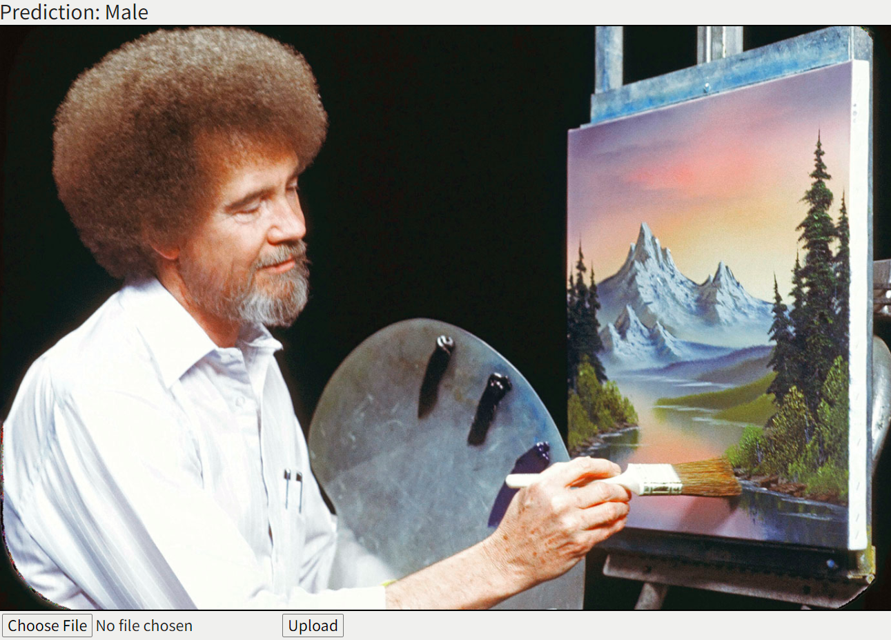

# Gender Recognition AI Website

---

## Table of Contents

- [gender-recognition-ai-site](#gender-recognition-ai-site)
  - [Table of Contents](#table-of-contents)
  - [About the Project](#about-the-project)
  - [About the Author](#about-the-author)
  - [Prerequisites](#prerequisites)
  - [Built With](#built-with)
  - [Technologies Used](#technologies-used)
  - [Practices Used](#practices-used)
  - [Contributing](#contributing)
  - [License](#license)
  - [Questions](#questions)

## About the Project

A version of my Gender Recognition AI hosted on the world wide web for all to use!
Please note that the current version of Gender Recognition AI only works on male and female.

* [Link to training code](https://github.com/AnakinTrotter/gender-recognition-ai/)
 
   
 
## About the Author
**Anakin Trotter**
- [Link to Anakin's GitHub](https://github.com/AnakinTrotter)
- [Link to Anakin's LinkedIn](https://linkedin.com/in/anakintrotter)

## Prerequisites

A modern internet browser such as Chrome, Firefox, or Safari.

## Built With
* [HTML](https://developer.mozilla.org/en-US/docs/Web/HTML)
* [CSS](https://developer.mozilla.org/en-US/docs/Web/CSS)
* [Python](https://www.python.org/downloads/)
* [Django](https://pypi.org/project/Django/)
* [Bootstrap](https://getbootstrap.com/)

## Technologies Used

* [Microsoft Visual Studio Code](https://code.visualstudio.com/)
* [GitHub](https://github.com/)
* [Google Chrome Developer Tools](https://developer.chrome.com/docs/devtools/)
  

## Practices Used

* [Web Content Accessibility Guidelines](https://www.w3.org/WAI/standards-guidelines/wcag/)

## Contributing

Contributions are encouraged! Please create a pull request with your updated code.

## License

This project is covered under the MIT license.

## Questions

Please create an issue should you have any questions or feature suggestions.
